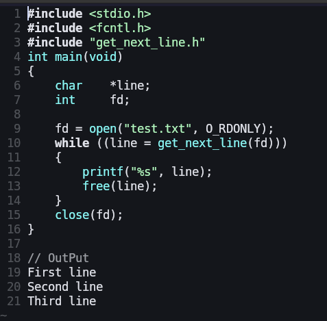

# 🧠 get_next_line


## 📜 Description
The **get_next_line** project is about creating a function that reads a line ending with a newline character `\n` from a file descriptor,
without losing the reading position between calls.

This project helps you master:
- Static variables  
- File descriptors  
- Memory management  
- Buffer handling  

It’s an essential step toward bigger projects like `pipex` and `minishell`.


## 🧩 Function Prototype
```
char    *get_next_line(int fd);

```


## 📸 Preview


